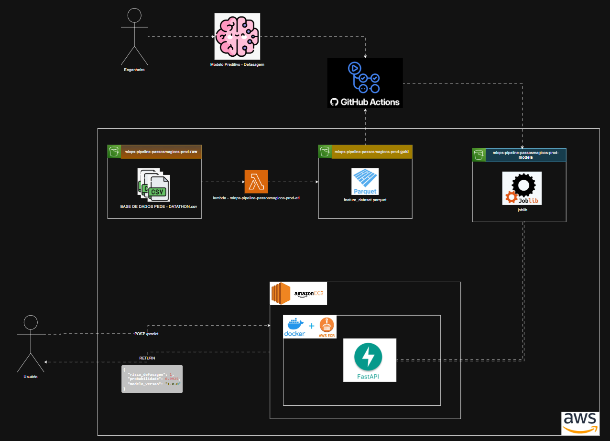

# 🚀 datathon-mlops-pipeline-passosmagicos-g96  

Projeto Datathon – Engenharia de Machine Learning  
Pipeline completa de MLOps para predição de risco de defasagem escolar – Passos Mágicos

---

# 📚 1) Visão Geral do Projeto

## 🎯 Objetivo

Desenvolver um modelo preditivo capaz de estimar o **risco de defasagem escolar** de cada estudante da instituição Passos Mágicos.

A defasagem escolar representa a diferença entre o nível ideal de aprendizado esperado e a fase atual do aluno, sendo um indicador essencial para ações pedagógicas preventivas.

O modelo permite:

- Identificar alunos com alto risco de defasagem
- Apoiar decisões pedagógicas baseadas em dados
- Priorizar acompanhamento psicopedagógico
- Democratizar o acesso à análise por meio de uma API

---

## 💡 Problema de Negócio

A instituição coleta diversos indicadores educacionais (INDE, IAA, IEG, IPS, IDA, IPV, IAN, notas, etc.), porém não havia um mecanismo automatizado capaz de:

- Integrar todos esses indicadores
- Gerar uma probabilidade objetiva de risco
- Disponibilizar essa previsão de forma acessível e escalável

Este projeto resolve esse problema por meio da construção de uma **pipeline completa de Machine Learning com práticas de MLOps**.

---

## 🧠 Solução Proposta

Construção de uma arquitetura completa de MLOps contendo:

1. Ingestão automatizada de dados (S3 → Lambda)
2. Feature Store em camada Gold (formato Parquet)
3. Treinamento automatizado do modelo via CI/CD
4. Versionamento do modelo
5. Deploy da API containerizada (Docker)
6. Deploy em EC2 (AWS Free Tier)
7. Testes unitários automatizados CI/CD  com Quality Gate

---
## 🧰 Stack Tecnológica

| Camada | Tecnologia |
|--------|------------|
| Linguagem | Python 3.11 |
| Machine Learning | scikit-learn |
| Processamento de Dados | pandas |
| API | FastAPI |
| Serialização | joblib |
| Testes | pytest + pytest-cov |
| Empacotamento | Docker |
| Infraestrutura | Terraform |
| Cloud | AWS |
| Armazenamento | Amazon S3 |
| Orquestração ETL | AWS Lambda |
| Deploy API | EC2 |
| Monitoramento | CloudWatch + Grafana |
| CI/CD | GitHub Actions |

---

# 🏛️ 2) Desenho de Arquitetura


# 🗂️ 3) Estrutura do Projeto

~~~
datathon-mlops-pipeline-passosmagicos-g96/
│
├── infra/ # Infraestrutura como código (Terraform)
│ ├── modules/
│ │ ├── s3/
│ │ ├── lambda/
│ │ ├── iam/
│ │ ├── ec2/
│ │ ├── ecr/
│ │ ├── vpc/
│ │ └── security/
│ ├── main.tf
│ ├── variables.tf
│ ├── locals.tf
│ └── outputs.tf
│
├── app_services/ # Códigos de application
│ ├── lambda_etl/
│ │ ├── handler.py
│ │ ├── feature_engineering.py
│ │ └── init.py
│ │
│ ├── api/
│ │ ├── main.py
│ │ ├── routes.py
│ │ ├── model/
│ │ │ └── model_latest.joblib
│ │ └── init.py
│
├── ml/
│ ├── config.py
│ ├── data.py
│ ├── train.py
│ ├── evaluate.py
│ └── init.py
│
├── tests/
│ ├── lambda_etl/
│ ├── api/
│ └── ml/
│
├── .github/workflows/ # Workflows para esteira CI/CD
│ ├── terraform.yml
│ ├── lambda-build.yml
│ ├── docker-build.yml
│ ├── train.yml
│ └── tests-auto-pr.yml
│
├── Dockerfile
├── requirements.txt
├── requirements-test.txt
└── README.md
~~~

---

# ⚙️ 4) Instruções de Deploy

## 🔧 Pré-requisitos

- Python 3.11+
- Docker
- Terraform 1.6+
- Conta AWS (Free Tier)
- GitHub

---

## 📦 Instalação de Dependências

📦 Instalação de Dependências
```bash
pip install -r requirements.txt
```

Para testes:
```bash
pip install -r requirements-test.txt
```

## 🏗️ Provisionar Infraestrutura

```bash
cd infra
terraform init
terraform plan
terraform apply
```

## 🧪 Executar Testes

```bash
pytest --cov=app_services --cov-report=term --cov-fail-under=80
```

## 🧠 Treinar Modelo

```bash
python ml/train.py
```

O modelo será salvo em:

```
app_services/api/model/model_latest.joblib
```

## 🐳 Build da API

```bash
docker build -t passosmagicos-api .
```

Executar container:

```bash
docker run -d -p 8000:8000 passosmagicos-api
```

Acessar documentação Swagger:

http://localhost:8000/docs

## 🌍 Acesso à API em Produção

A API também está disponível em ambiente produtivo:

http://3.19.241.130:8000/docs/

## 🌍 5) Exemplos de Chamadas à API

### 📌 Endpoint

POST /predict

### 🔹 Exemplo via curl

```bash
curl -X POST "http://SEU_IP_PUBLICO:8000/predict" \
-H "Content-Type: application/json" \
-d '{
  "idade": 17,
  "inde": 4.2,
  "iaa": 4.0,
  "ieg": 3.5,
  "ips": 5.0,
  "ida": 4.1,
  "ipv": 3.8,
  "ian": 4.5,
  "matem": 3.2,
  "portug": 4.0,
  "ingles": 3.8
}'
```

### 🔹 Resposta Esperada

```json
{
  "risco_defasagem": 1,
  "probabilidade": 0.82,
  "modelo_versao": "1.0.0"
}
```

## 🔄 6) Etapas do Pipeline de Machine Learning

### 🧹 1. Pré-processamento dos Dados

- Normalização de nomes de colunas
- Padronização de tipos numéricos
- Correção de separador decimal
- Tratamento de valores nulos
- Conversão da coluna defas para variável alvo binária

Regra aplicada:

- 0 = sem defasagem
- -1 ou -2 = com defasagem

### 🧬 2. Engenharia de Features

Features utilizadas:

- **idade**: Idade do aluno no ano de referência (exemplo: 17, range: 5-25)
- **inde**: Índice de Desenvolvimento Educacional (métrica agregada) (exemplo: 7.1, range: 0-10)
- **iaa**: Indicador de Auto Avaliação do aluno (exemplo: 8.0, range: 0-10)
- **ieg**: Indicador de Engajamento (exemplo: 6.5, range: 0-10)
- **ips**: Indicador Psicossocial (exemplo: 7.0, range: 0-10)
- **ida**: Indicador de Aprendizagem (exemplo: 6.0, range: 0-10)
- **ipv**: Indicador de Ponto de Virada (exemplo: 7.5, range: 0-10)
- **ian**: Indicador de Adequação ao Nível (exemplo: 8.0, range: 0-10)
- **matem**: Nota média de Matemática (exemplo: 6.5, range: 0-10)
- **portug**: Nota média de Português (exemplo: 7.2, range: 0-10)
- **ingles**: Nota média de Inglês (exemplo: 6.8, range: 0-10)

Criação da variável alvo:

risco_defasagem ∈ {0,1}

### 🤖 3. Treinamento e Validação

Modelo utilizado:

RandomForestClassifier

Técnicas aplicadas:

- Stratified train_test_split
- class_weight="balanced"

Avaliação com:

- Precision
- Recall
- F1-score
- ROC-AUC

### 🏆 4. Seleção de Modelo

Random Forest foi escolhido por:

- Robustez a outliers
- Boa performance com dados tabulares
- Baixo risco de overfitting
- Interpretação via feature importance

### 🔄 5. Pós-processamento

- Geração de probabilidade
- Definição de threshold
- Serialização com joblib
- Versionamento do modelo

## 📈 Monitoramento Contínuo

- Logs estruturados via CloudWatch
- Métricas da API monitoradas
- Arquitetura preparada para evolução com monitoramento de drift

## 🔐 CI/CD e Quality Gate

- Testes automatizados via GitHub Actions
- Cobertura mínima obrigatória de 80%
- PR criada automaticamente apenas se testes passarem
- Infraestrutura provisionada via Terraform
- Build e deploy automatizados da API via ECR -> EC2

## 🏗️ Arquitetura Final

```
S3 (raw)
   ↓
Lambda (ETL + Feature Engineering)
   ↓
S3 (gold)
   ↓
Pipeline ML (CI/CD)
   ↓
Modelo versionado (.joblib)
   ↓
Docker (FastAPI)
   ↓
EC2
   ↓
CloudWatch + Grafana
```

## 👨‍💻 Desenvolvedor

Vinnicius Toth  
Engenharia de Dados & Machine Learning  
FIAP – Engenharia de Machine Learning